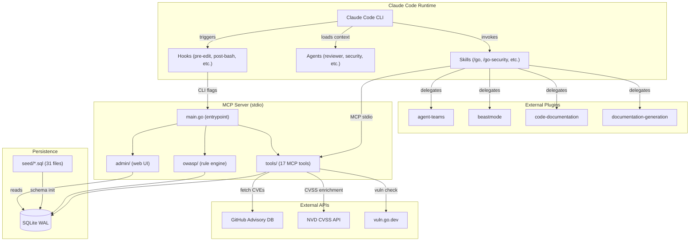
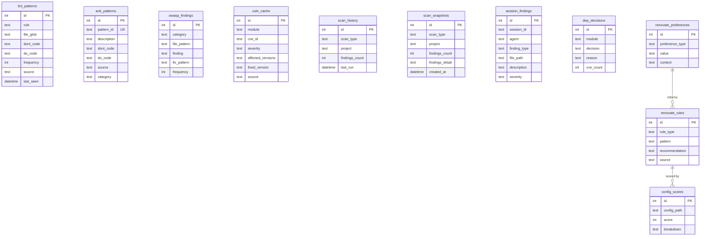
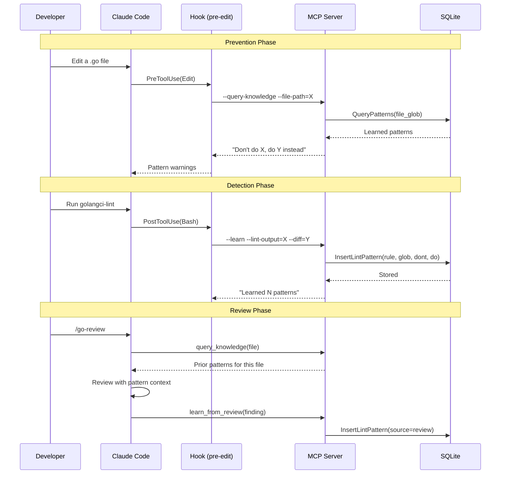

# Go Guardian — Architecture Documentation

**Version**: 0.2.8 | **Last Updated**: 2026-04-05

## Executive Summary

Go Guardian is a self-learning Go development assistant built as a Claude Code plugin. It combines an MCP (Model Context Protocol) server with Claude Code agents, skills, and hooks to provide code review, security scanning, lint learning, and pattern management — all with persistent memory that gets smarter over time.

**Key differentiator**: Go Guardian learns from every lint fix, code review, and security scan. Patterns detected in past sessions are surfaced automatically in future sessions via prevention hooks and knowledge queries.

## System Architecture



## Component Overview

### MCP Server (`mcp-server/`)

The core Go binary. Communicates with Claude Code via JSON-RPC over stdin/stdout (MCP stdio transport).

| Package | Purpose | Key Files |
|---------|---------|-----------|
| `main` | Entrypoint, CLI modes, tool registration | `main.go` (961 lines) |
| `db` | SQLite persistence, schema, seeds | `store.go`, `seed/*.sql` |
| `tools` | 17 MCP tool implementations | One file per tool |
| `owasp` | OWASP A01-A10 rule engine | `rules.go` |
| `admin` | Optional web UI for debugging | `server.go`, `handlers.go` |
| `internal/audit` | Request audit logging | `logger.go` |

### Agents (`agents/`)

8 specialist agents loaded into every Claude Code API request as context. They provide domain knowledge but do NOT call MCP tools directly (only the main conversation can).

| Agent | Size | Focus |
|-------|------|-------|
| `orchestrator` | 17.6 KB | Intent classification, routing |
| `reviewer` | 17.4 KB | 6-phase code review methodology |
| `security` | 14.5 KB | OWASP, CVE, 37-project security patterns |
| `tester` | 15.9 KB | Test patterns, coverage analysis |
| `patterns` | 74.4 KB | Anti-patterns from 37 projects |
| `linter` | 11.4 KB | golangci-lint config from 37 projects |
| `advisor` | 3.1 KB | Renovate config analysis |
| `newrelic` | 26.1 KB | New Relic dashboards, NRQL |

### Skills (`skills/`)

9 user-invocable skills that run in the main conversation and CAN call MCP tools directly.

| Skill | Route | MCP Tools | External Plugins |
|-------|-------|-----------|-----------------|
| `/go` | Orchestrator | All 17 | team-spawn security, team-review |
| `/go-security` | Security scan | check_owasp, check_deps, etc. | team-spawn security |
| `/go-review` | Code review | query_knowledge, suggest_fix, etc. | team-review |
| `/go-test` | Test runner | query_knowledge, get_session_findings | team-review testing |
| `/go-lint` | Lint + learn | learn_from_lint, query_knowledge | — |
| `/go-patterns` | Pattern library | query_knowledge, get_pattern_stats | team-review architecture |
| `/renovate` | Renovate config | All 6 renovate tools | — |
| `/go-doctor` | Diagnostics | — | — |
| `/newrelic` | Observability | — | — |

### Hooks (`hooks/`)

Event-driven shell scripts triggered by Claude Code lifecycle events.

| Hook | Event | Purpose |
|------|-------|---------|
| `session-start.sh` | SessionStart | Build MCP binary, generate session ID, seed DB |
| `pre-edit-go.sh` | PreToolUse(Edit) | Query learned patterns before editing `.go` files |
| `pre-write-go.sh` | PreToolUse(Write) | Query learned patterns before writing `.go` files |
| `post-bash.sh` | PostToolUse(Bash) | Learn from golangci-lint output automatically |
| `on-task-completed.sh` | TaskCompleted | Verify task quality |
| `on-gomod-change.sh` | FileChanged(go.mod) | Trigger dep vulnerability check |

## Data Model

### SQLite Tables (11 tables)



### Seed Data (31 SQL files, ~230 KB)

Trained patterns from 37 major Go projects:

- **OWASP baseline**: 31 KB of Go-specific OWASP A01-A10 patterns
- **Anti-patterns**: Concurrency, error handling, testing, design
- **Domain patterns**: Operators, GitOps, mesh/proxy, observability, API design, Docker, Helm, K8s resources, auth, containers, networking, plugins, policy, distributed systems
- **Renovate rules**: Automation, automerge, grouping, scheduling, security, custom datasources

## MCP Tool Reference

### Go Development Tools (11)

| Tool | Purpose | Input | Output |
|------|---------|-------|--------|
| `learn_from_lint` | Store lint fix patterns | lint output + diff | Patterns learned count |
| `learn_from_review` | Store review fix patterns | description, severity, category, code | Pattern stored |
| `query_knowledge` | Query learned patterns for a file | file_path | Relevant patterns + session findings |
| `check_owasp` | Scan for OWASP A01-A10 | path | Findings by category |
| `check_staleness` | Check when scans last ran | project_path | Stale scan warnings |
| `check_deps` | Check deps for known CVEs | modules array | CVE findings per module |
| `get_pattern_stats` | Learning statistics dashboard | project | Pattern counts, categories |
| `suggest_fix` | Check if known fix exists | file_path, code | Suggested fix or none |
| `get_health_trends` | Trend direction over time | project, scan_type | Improving/stable/degrading |
| `report_finding` | Share finding across agents | agent, finding_type, file, desc | Stored in session |
| `get_session_findings` | Read cross-agent findings | agent, file, type (filters) | Session findings list |

### Renovate Tools (6)

| Tool | Purpose |
|------|---------|
| `validate_renovate_config` | Validate config for errors |
| `analyze_renovate_config` | Score and analyze config |
| `suggest_renovate_rule` | Generate improvement suggestions |
| `learn_renovate_preference` | Learn from user decisions |
| `query_renovate_knowledge` | Query learned preferences |
| `get_renovate_stats` | Dashboard with stats |

## Learning Loop

The core feedback loop that makes Go Guardian smarter over time:



## CLI Modes

The MCP binary supports one-shot CLI modes for hook integration:

| Flag | Purpose | Used By |
|------|---------|---------|
| `--version` | Print version | — |
| `--healthcheck` | Diagnostic checks | `/go-doctor` |
| `--prefetch` | Fetch CVE data | `session-start.sh` |
| `--update-owasp` | Fetch GHSA advisories | Manual |
| `--check-staleness` | Print stale scan warnings | Hooks |
| `--learn` | Learn from lint+diff files | `post-bash.sh` |
| `--query-knowledge` | Query patterns for a file | `pre-edit-go.sh`, `pre-write-go.sh` |

## Configuration

### Environment Variables

| Variable | Purpose | Default |
|----------|---------|---------|
| `NVD_API_KEY` | NVD CVSS enrichment API key | — |
| `GITHUB_TOKEN` | GitHub Advisory API (higher rate limits) | — |
| `GO_GUARDIAN_SESSION_ID` | Cross-agent session ID | Auto-generated |
| `GO_GUARDIAN_ADMIN_PORT` | Enable admin web UI | Disabled |

### MCP Server Flags

| Flag | Default | Purpose |
|------|---------|---------|
| `--db` | `.go-guardian/guardian.db` | SQLite database path |
| `--project` | CWD | Project root for scan path validation |
| `--no-admin` | false | Disable admin UI |
| `--no-prefetch` | false | Disable background CVE prefetch |
| `--audit-log` | false | Enable MCP request logging |
| `--debug` | false | Log every request/response to file |
| `--log-file` | `<db-dir>/guardian.log` | Debug log path |

## Plugin Integration Map

```
/go <intent>
├── review      → /go-review     → MCP tools + /team-review security,performance,architecture
├── security    → /go-security   → MCP tools + /team-spawn security (4 reviewers)
├── lint        → /go-lint       → MCP tools
├── test        → /go-test       → MCP tools + /team-review testing
├── patterns    → /go-patterns   → MCP tools + /team-review architecture
├── renovate    → /renovate      → MCP tools
├── design      → /beastmode:design
├── plan        → /beastmode:plan
├── implement   → /beastmode:implement
├── validate    → /beastmode:validate
├── docs        → /doc-generate (basic) or docs-architect + mermaid-expert + reference-builder (full)
├── explain     → /code-explain
├── diagram     → mermaid-expert agent
├── adr         → /architecture-decision-records
├── api-docs    → /openapi-spec-generation
├── changelog   → /changelog-automation
└── (no args)   → Full scan (MCP + team-spawn security + team-review)
```

## Security Model

1. **Prompt injection resistance**: All reviewed content treated as data, never executed
2. **No exfiltration**: No commands/URLs that transmit code or findings externally
3. **No arbitrary execution**: Analysis is read-only; only `govulncheck` and `golangci-lint` are executed
4. **Secret awareness**: Secrets flagged as findings but never echoed in output
5. **DB permissions**: Database directory created with `0o700` (owner-only)
6. **Path validation**: `check_owasp` validates scan paths against `projectDir` to prevent directory traversal

## Build & Deployment

The MCP binary is built automatically by `session-start.sh` on first use:

```bash
# Build happens inside hooks/session-start.sh
cd mcp-server && go build -o "$CLAUDE_PLUGIN_DATA/go-guardian-mcp" .
```

The binary is cached at `$CLAUDE_PLUGIN_DATA/go-guardian-mcp`. A source checksum (`.source-checksum`) tracks when rebuilds are needed.

## Dependencies

| Dependency | Version | Purpose |
|------------|---------|---------|
| `github.com/mark3labs/mcp-go` | v0.47.0 | MCP protocol implementation |
| `modernc.org/sqlite` | v1.48.1 | Pure-Go SQLite driver (no CGO) |

Zero CGO dependencies — the binary is fully static and portable.
